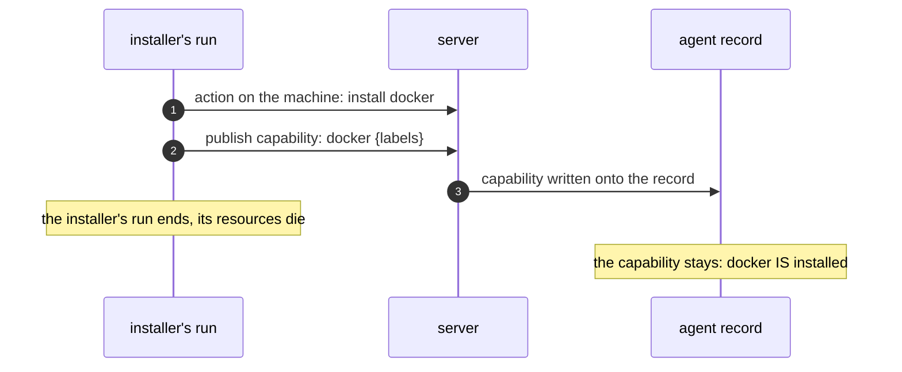

# Agents

## A process and a record

An agent is two things at once: a **process** on the user's machine
and a **resource** — the record linking the real machine to that
process. Declaring an agent never creates a machine: the record waits
for its agent to connect. The machine opens no ports; the agent
connects outward, with its own token.

How the agent gets onto the machine — two equal paths that converge
into the same connection:

```mermaid
sequenceDiagram
    autonumber
    participant P as pipeline code (run)
    participant S as server
    participant E as agent record
    participant M as machine

    P->>S: declare agent (name[, ssh credentials])
    S->>E: create the record — phase: creating
    alt fresh VM: user-data
        Note over M: the VM is created elsewhere (a resource library);<br/>user-data carries the install script
        M->>M: boot: installs the agent
    else existing machine: SSH
        S->>M: connects over SSH, runs the same install script
    end
    M->>S: the agent connects (agent token, outbound)
    S->>E: agent connected, machine facts recorded
    E-->>E: needs met? → phase: ready
    P->>S: handle.Ready
    S-->>P: agent state
```

Both paths run one and the same install script — two scripts would
drift.

## Capabilities are written, never discovered

What a machine CAN do is written onto its record by a publisher — an
installer, a person, a machine image. A capability has a name, labels,
an informative version, and a readiness flag. It belongs to the
machine, not to whoever published it:



## Readiness is one formula

An agent is ready when two conditions hold at once: the agent is
connected, and every need of the declaration is met — the required
capability is on the record, ready, and matches the label constraints.
`Ready` on the agent's handle waits for both: the refusal comes before
work is dispatched to the machine, not after it fails there.

Needs match capabilities by name plus label constraints — equality and
"one of". Versions are never compared.

## Selection and fan-out

Agents can be selected without knowing their names: a selector over
labels and needs returns a snapshot of the matching agents; an action
addressed to the set executes on every machine of the set.

## Foreign agents

An agent declared by someone else can be **attached**: recognized and
read like any handle, never created. An attached agent takes actions
like your own; the only difference — it cannot be a parent or a child
in the ownership tree.
