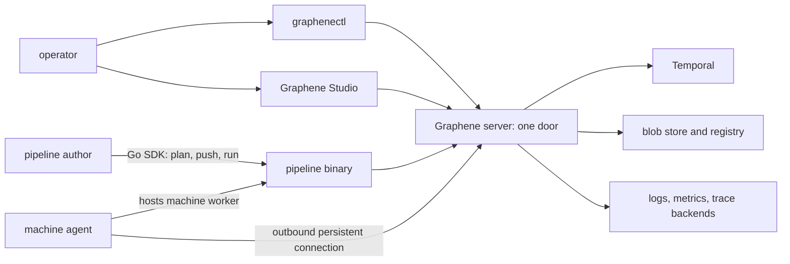

# Architecture

Graphene is a control plane around durable workflows. It has one public door
and several independently delivered clients and runtimes.

## Server and one door

The `graphene` server is the installation's only public endpoint. The same
listener serves the Management API used by browsers and `graphenectl`, the
worker and agent protocols, the Temporal proxy, OTLP ingestion, health probes,
and the container-registry proxy. Authentication and namespace selection are
therefore applied at one boundary.

The server owns system resource kinds, run arbitration, source materialization,
tokens and secrets, blob storage, and adapters to telemetry backends. Temporal
is its durable execution core, not a public authoring API.

## Pipeline binary

A pipeline is a compiled program using the `pipeline` Go SDK. One binary has
three responsibilities:

- record its typed manifest and optimistic plan;
- manage its project-facing commands (`plan`, `push`, `run`);
- serve the run or machine Temporal worker role selected by the environment.

Resource libraries register their own activities and kinds into this worker.
The server does not need a hard-coded provider catalogue.

## Agent

The agent represents one Linux machine. It opens a persistent outbound
connection, reports facts and health, receives bounded host operations, and
uses `runc` to host one machine-worker container per run. The user pipeline
code inside that container serves the machine queue; the agent is not a second
workflow engine.

## Records and clients

Every resource is a durable record. System kinds and library-brought kinds use
the same identity, ownership, lifecycle, command, and observability model.
`graphenectl` discovers kinds and commands from the installation dictionary;
Studio consumes the same Management API and keeps no private server contract.
