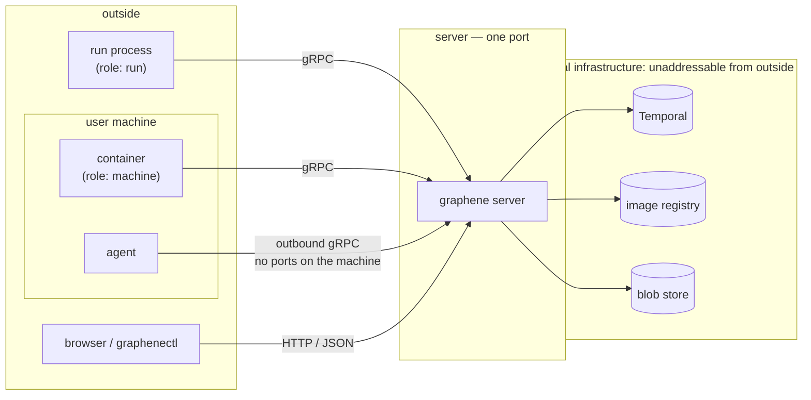
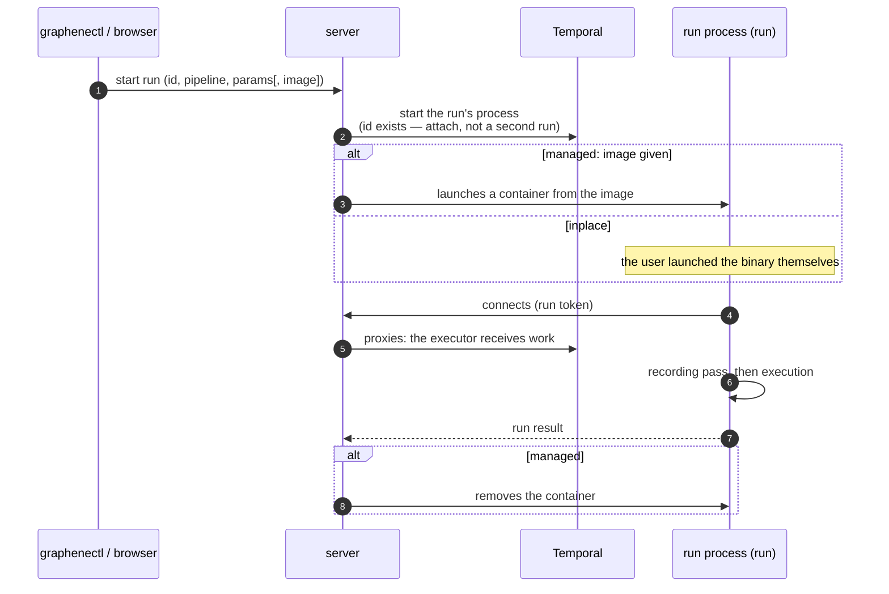
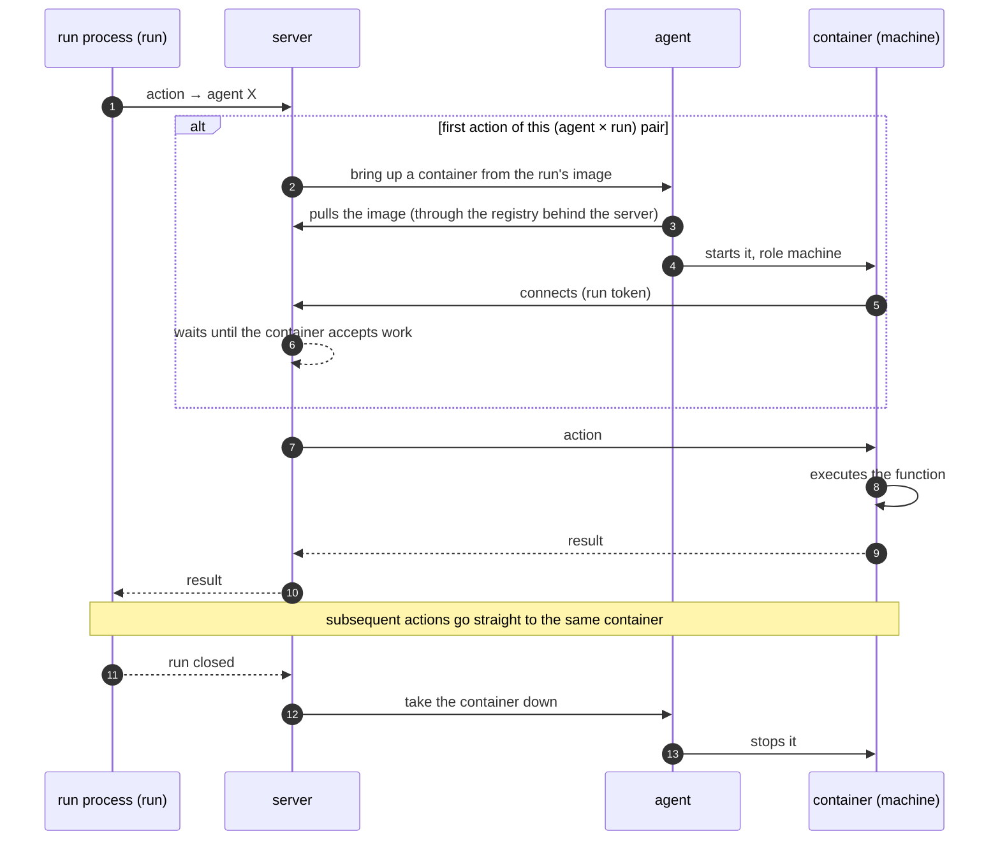
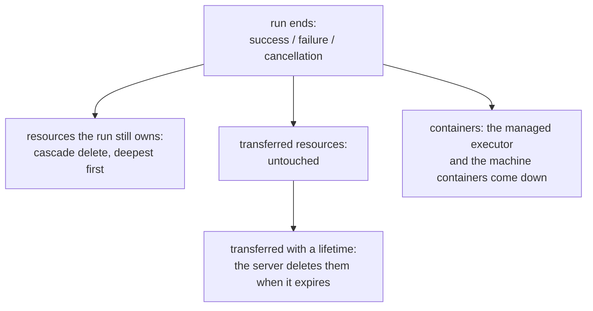

# Execution model

## One binary

A pipeline compiles into one binary. That binary executes in two
roles; the code is the same, the launch environment assigns the role:

| Role | Where it runs | What it does |
|---|---|---|
| `run` | the run's process: a container launched by the server, or a process launched by the user | drives the run |
| `machine` | a container on an agent's machine | executes the actions addressed to that machine |

There is no third form: everything the user writes executes in one of
these two instances of the same binary.

## Who connects to whom

There are exactly three kinds of connections in the system, all
leading to the server — outbound. The internal infrastructure —
Temporal (the durable core), the image registry, the blob store — is
invisible and unaddressable from outside:

The pipeline, the agent, and the browser know one address: the
server's port.

## The run

A run starts through the server. The identifier names exactly one
run: starting it again with the same id attaches to the existing one
instead of creating a second.

There are two ways to give a run its executor:

- **Managed** — an image is given at start: the server launches the
  container itself and removes it after completion.
- **Inplace** — the user launches the binary themselves, anywhere:
  local development, their own orchestrator. The server only starts
  the run's process.

A run is recoverable: the execution history lives in Temporal, not in
the process. A crash, a restart, a network drop lose nothing — when
the executor comes back, the run continues from where it stopped.
Successfully completed actions never execute twice.

## Actions on a machine

An action is always addressed to an agent and executes on its
machine — not in the run's process. One container per (agent × run)
pair, brought up by the first action:

The agent is a host, not an executor: it brings the container up and
watches it, but never looks inside the actions.

## The recording pass

Before the run starts, the pipeline function executes once in
recording mode:

- nothing executes — declarations of actions and resources only get
  registered;
- reads from resources return optimistic zeros (booleans — `true`),
  so guard conditions do not cut the walk short;
- everything found — actions, resource kinds — is known to the
  executor before work begins.

This is why actions and resources are declared right where they are
used, with no separate registration. The price: pipeline code must
survive a pass with zero-valued data.

## Run completion

Success, failure, and cancellation end down the same road:

