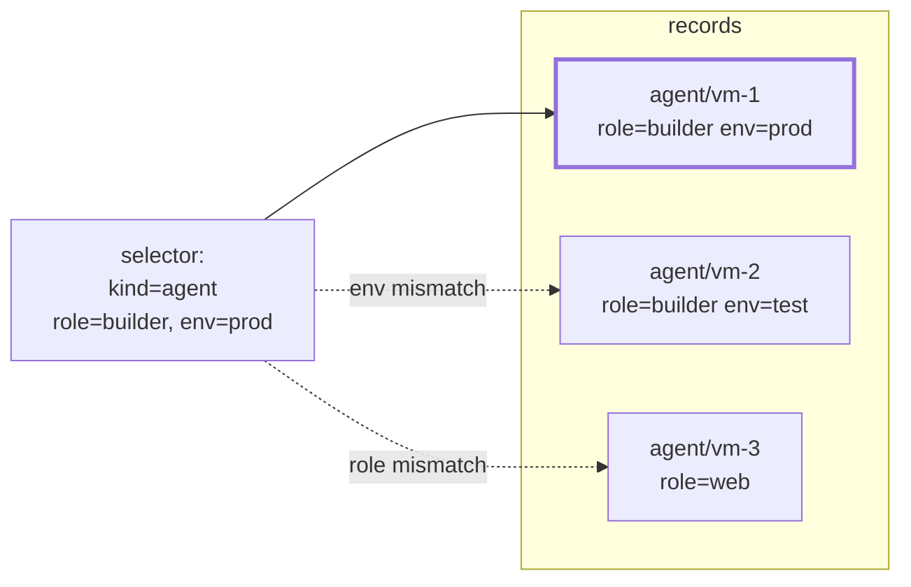

# Labels

## Markers, never data

A **label** is a `key=value` pair on any record and on a run.
Metric-label semantics: selection and grouping, never data. Labels are
set at declaration and changed by a record command; the system never
interprets the values.

Keys under the reserved `graphene.io/` prefix are **system labels**,
written only by the system; user input with this prefix is rejected.
`graphene.io/run` names the run that created the record — stable
across transfers, unlike the owner.

## Selection

A **selector** is kind + phase + owner + labels; every set field must
match. Selection works the same everywhere labels appear — listing
records, choosing agents, filtering runs:

Matching is equality and "one of" — nothing else. There are no
comparisons, no expressions, no versions: a selector the system could
interpret would be one more thing to be wrong about.
