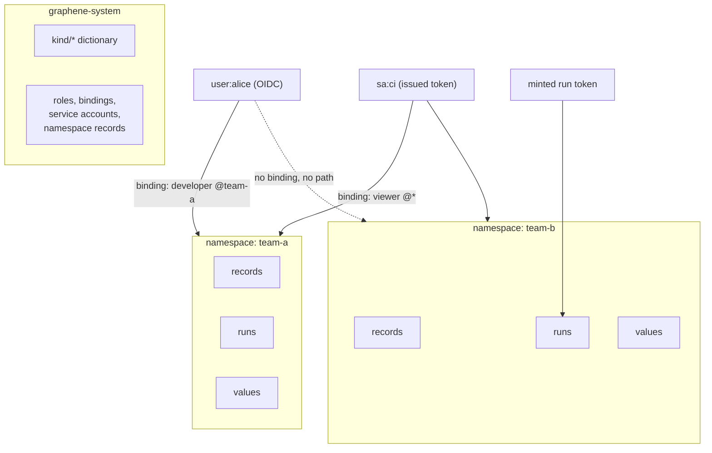

# Namespaces & access

## The unit of isolation

A **namespace** isolates everything: records, runs, and values of
different namespaces do not see each other. Every graphene namespace
mirrors into a Temporal namespace of the same name — the isolation
holds at the durable-core level, not as filters in server code.

Namespaces are **records** (`kind: namespace`), declared and deleted
like everything else. They live in the system namespace
`graphene-system` — a container cannot hold its own declaration — which
also holds the installation's roles, bindings and service accounts.
`graphene-system` is the protected installation namespace. `default` is
created on the first boot as an ordinary project namespace and may be deleted.
Deleting a namespace *retires* it: the installation stops serving it, but its
contents age out under their own retention rather than being destroyed. A
retired namespace stays retired across server restarts.

## Who may do what

Authorization is k8s-shaped and additive: a right is
**verb × kind × namespace**, granted by `role` records and bound to
subjects by `rolebinding` records. Subjects come from three identity
contours:

- **people — OIDC**: the installation accepts an external provider's
  id_token (`user:{sub}`, `group:{name}`); no password store of its own;
- **machines — service accounts** (`serviceaccount/{id}`): records
  whose tokens the installation issues and revokes itself
  (`graphenectl account token`, value shown once);
- **runs and agents — minted tokens**: scoped to one run or one agent
  record, expiring with it; verification needs no storage.

Static config tokens (`admin`/`run`/`agent`) remain as the bootstrap
and dev path — they map onto built-in roles.

Every command lands as a note in the record's own history — the audit
is the record's, not a separate journal. Reads are not audited.
