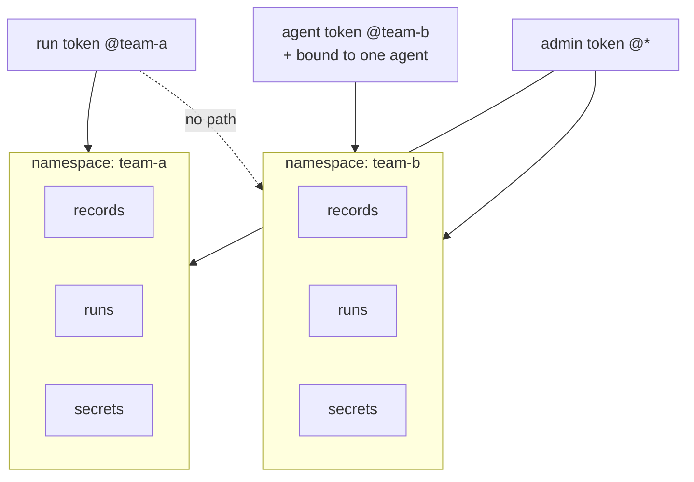

# Namespaces

## The unit of isolation

A **namespace** isolates everything: records, runs, and secrets of
different namespaces do not see each other. Every graphene namespace
mirrors into a Temporal namespace of the same name — the isolation
holds at the durable-core level, not as filters in server code.

## Tokens carry the scope

A **token** is the only kind of credentials. Three roles — `admin`,
`run`, `agent` — and every token is bound to a namespace; an admin
token may be bound to all of them:

An agent token is additionally bound to one agent: it can embody that
record and no other.
