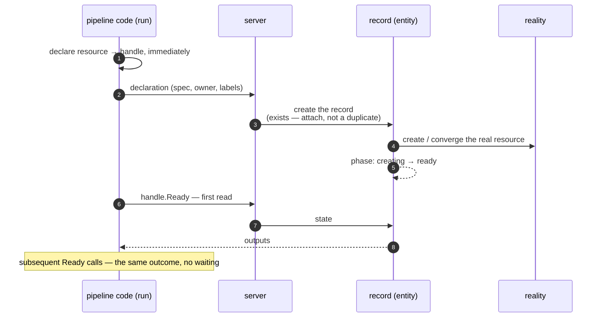
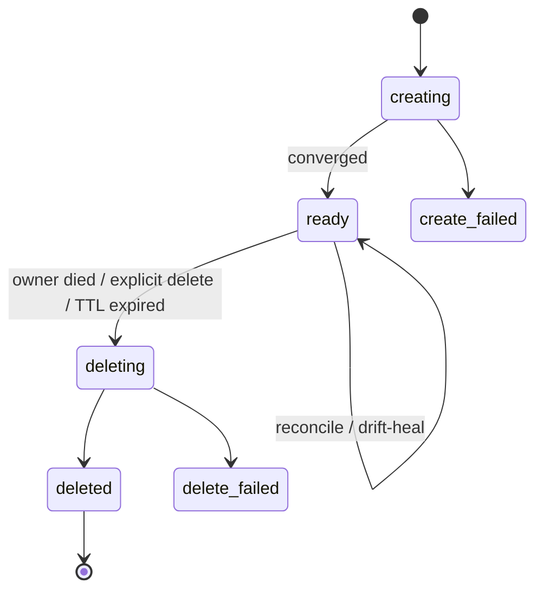
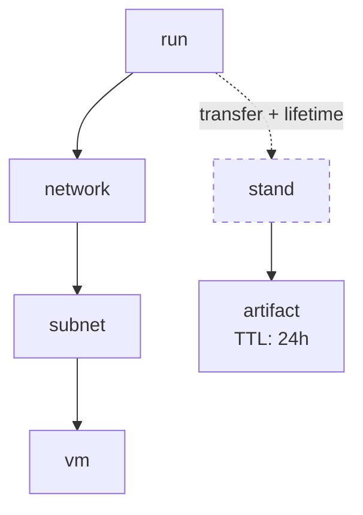
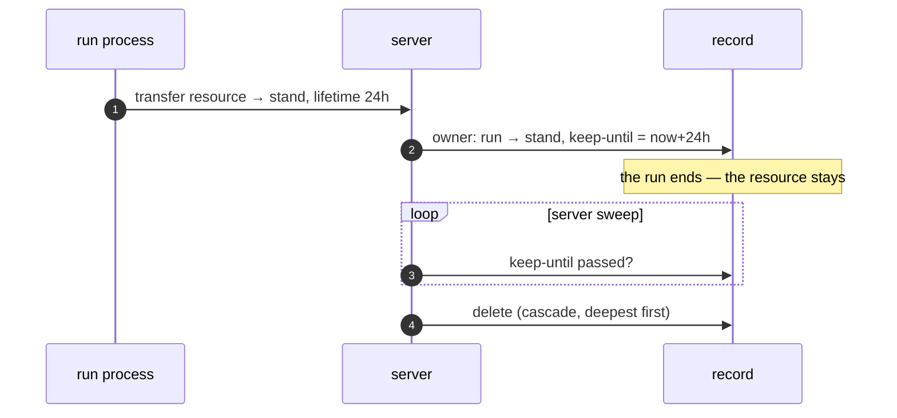

# Resources

## Declaration returns a handle

Declaring a resource is an ordinary function call in the pipeline. It
returns a **handle** immediately, without blocking; the record is
created and the real resource converges in the background:

The outputs of a resource are reachable only through `Ready`: the
first read waits for convergence, and a readiness failure fails the
run at that point. An unready resource is impossible to use by
construction. Code that wants the error in hand calls `TryReady` — the
same operation returning the error as a value instead of failing the
run.

## The record lives a lifecycle

Every resource is backed by exactly one record. Its phase is visible
at any moment:

The record is a live process: while the resource exists, it
periodically reconciles the observed state against the desired one.
Disappearance and divergence are a reason to recreate or converge;
what counts as divergence is the resource library's knowledge.

## Every resource has one owner

The owner is the one a resource dies with: another resource, a run,
or the stand. Exactly one; by default — the run that created it.
Owners form a tree, declared with `Parent` and `Children` and changed
by transfer:

Deleting an owner deletes its whole subtree, deepest first: the vm
before the subnet, the subnet before the network. A cancelled or
crashed run is a death like any other — its subtree goes down the same
road.

Two principles hold everywhere:

- **Ownership is given away — never taken.** A transfer is performed
  by the current owner's side; nothing can claim a resource for
  itself.
- **What is not yours cannot be burdened or given away.** A foreign
  resource can be *attached* — recognized and read like any handle —
  but an attached resource cannot be a parent or a child.

## Outliving the run

By default a run's resources die with the run. The only way to
outlive it is an explicit transfer — to another resource, or to the
pipeline's **stand**: the permanent owner every pipeline has. A
transfer moves the resource together with its subtree and may set a
**lifetime** — when it expires, the server deletes the subtree
itself:

Without a lifetime, a transferred resource lives until an explicit
delete.
