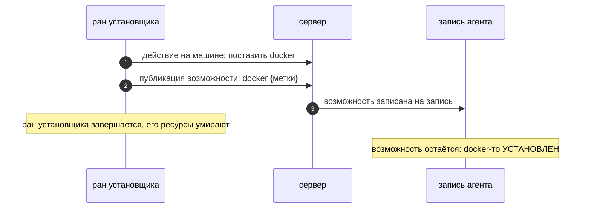

# Агенты

## Процесс и запись

Агент — две вещи сразу: **процесс** на машине пользователя и
**ресурс** — запись, связывающая реальную машину с этим процессом.
Объявление агента не создаёт машину: запись ждёт, пока её агент
подключится. Машина не открывает портов; агент подключается наружу,
со своим токеном.

Как агент попадает на машину — два равноправных пути, сходящихся в
одно подключение:

```mermaid
sequenceDiagram
    autonumber
    participant P as код пайплайна (run)
    participant S as сервер
    participant E as запись агента
    participant M as машина

    P->>S: объявление агента (имя[, ssh-реквизиты])
    S->>E: создать запись — фаза creating
    alt свежая VM: user-data
        Note over M: VM создаётся другим ресурсом (библиотекой);<br/>user-data несёт скрипт установки
        M->>M: загрузка: ставит агента
    else существующая машина: SSH
        S->>M: подключается по SSH, выполняет тот же скрипт
    end
    M->>S: агент подключается (токен агента, исходящее)
    S->>E: агент подключён, факты машины записаны
    E-->>E: требования выполнены? → фаза ready
    P->>S: handle.Ready
    S-->>P: состояние агента
```

Оба пути выполняют один и тот же скрипт установки — два скрипта
разъехались бы.

## Возможности записываются, не обнаруживаются

Что машина УМЕЕТ — записано на её записи публикатором: установщиком,
человеком, образом машины. У возможности есть имя, метки,
информативная версия и признак готовности. Она принадлежит машине, а
не тому, кто её опубликовал:



## Готовность — одна формула

Готовность агента — два условия сразу: агент подключён, и каждое
требование объявления выполнено — нужная возможность есть на записи,
готова и проходит по меткам. `Ready` на хэндле агента ждёт оба
условия: отказ приходит до отправки работы на машину, а не после её
падения.

Требования матчатся с возможностями по имени плюс ограничениям на
метки — равенство и «одно из». Версии никогда не сравниваются.

## Выборка и веер

Агентов можно выбирать, не зная имён: селектор по меткам и
требованиям возвращает снапшот подходящих агентов; действие,
адресованное набору, выполняется на каждой машине набора.

## Чужие агенты

Агента, объявленного не вами, можно **присоединить**: распознать и
читать как любой хэндл, никогда — создать. Присоединённый агент
принимает действия как свой; единственная разница — он не может быть
родителем или ребёнком в дереве владения.
