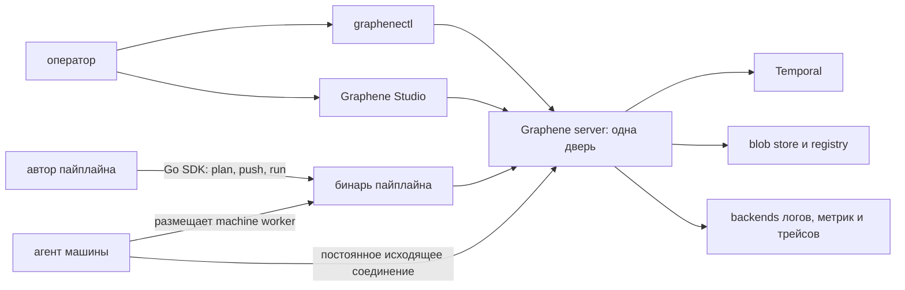

# Архитектура

Graphene — control plane вокруг durable workflows. У него одна публичная дверь
и несколько независимо поставляемых клиентов и runtime-компонентов.

## Сервер и одна дверь

Сервер `graphene` — единственная публичная endpoint инсталляции. Один listener
обслуживает Management API браузера и `graphenectl`, worker- и agent-протоколы,
proxy к Temporal, OTLP ingest, health probes и proxy container registry. Поэтому
аутентификация и выбор namespace применяются на одной границе.

Сервер владеет системными kinds, арбитражем ранов, материализацией исходников,
токенами и секретами, blob storage и адаптерами telemetry backends. Temporal —
его durable execution core, а не публичный authoring API.

## Бинарь пайплайна

Пайплайн — скомпилированная программа на Go SDK `pipeline`. Один бинарь:

- записывает типизированный manifest и оптимистичный plan;
- реализует проектные команды `plan`, `push`, `run`;
- обслуживает роль run- или machine-worker, выбранную окружением.

Resource libraries регистрируют собственные activities и kinds в этом worker.
Серверу не нужен зашитый каталог провайдеров.

## Агент

Агент представляет одну Linux-машину. Он открывает постоянное исходящее
соединение, сообщает facts и health, принимает ограниченные host operations и
через `runc` размещает один machine-worker container на ран. Пользовательский
код пайплайна в контейнере обслуживает очередь машины; агент не является вторым
workflow engine.

## Записи и клиенты

Каждый ресурс — durable-запись. Системные и принесённые библиотеками kinds
используют одну модель identity, ownership, lifecycle, commands и
observability. `graphenectl` узнаёт kinds и commands из словаря инсталляции;
Studio работает с тем же Management API и не имеет собственного серверного
контракта.
