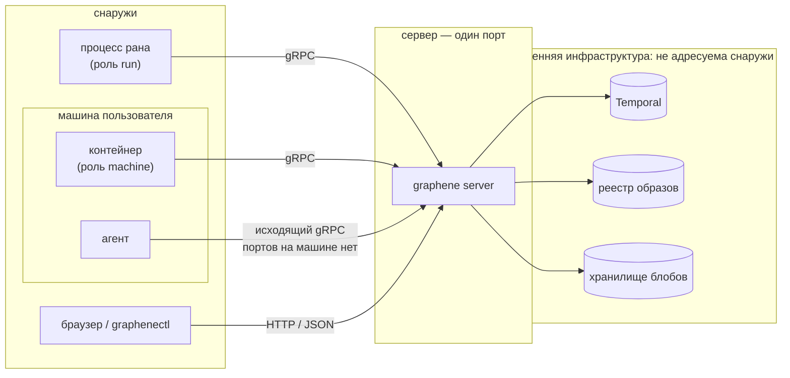
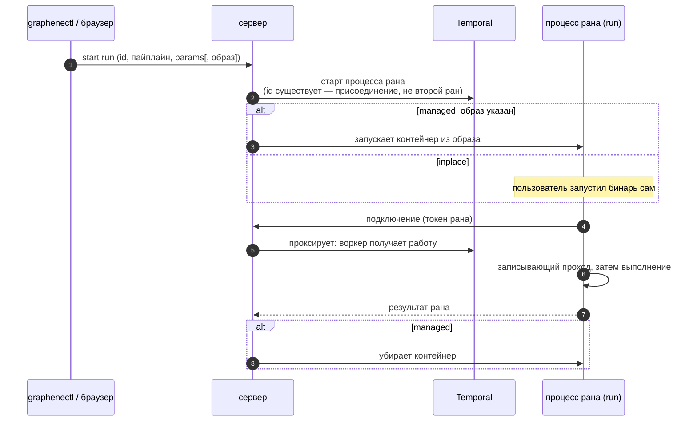
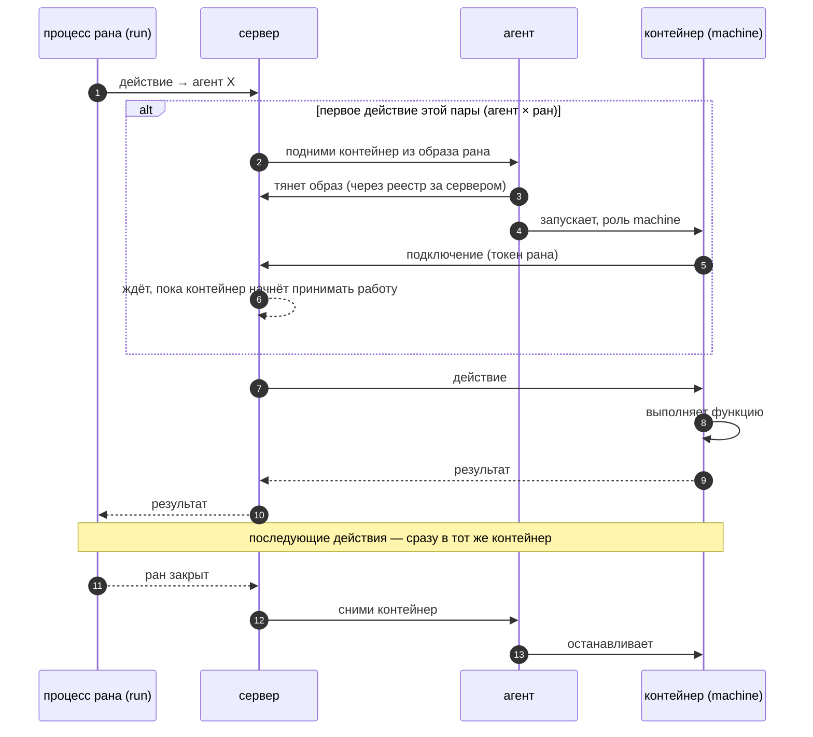
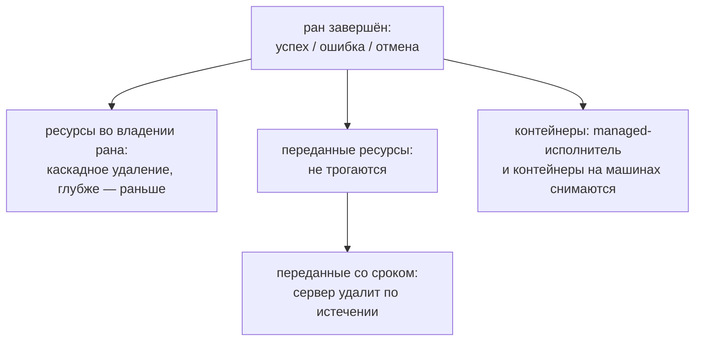

# Модель выполнения

## Один бинарь

Пайплайн компилируется в один бинарь. Этот бинарь исполняется в двух
ролях; код одинаковый, роль назначает окружение запуска:

| Роль | Где работает | Что делает |
|---|---|---|
| `run` | процесс рана: контейнер, запущенный сервером, или процесс, запущенный пользователем | ведёт ран |
| `machine` | контейнер на машине агента | выполняет действия, адресованные этой машине |

Третьей формы нет: всё, что пишет пользователь, исполняется одним из
этих двух экземпляров одного бинаря.

## Кто с кем соединяется

Соединений в системе ровно три вида, все ведут к серверу — исходящие.
Внутренняя инфраструктура — Temporal (durable-ядро), реестр образов,
хранилище блобов — снаружи не видна и не адресуема:

Пайплайн, агент и браузер знают один адрес: порт сервера.

## Ран

Ран стартует через сервер. Идентификатор называет ровно один ран:
повторный старт с тем же id присоединяется к существующему, а не
создаёт второй.

Дать рану исполнителя можно двумя способами:

- **Managed** — при старте указан образ: сервер сам запускает
  контейнер и сам убирает его после завершения.
- **Inplace** — пользователь запускает бинарь сам, где угодно:
  локальная разработка, свой оркестратор. Сервер только стартует
  процесс рана.

Ран восстановим: история выполнения живёт в Temporal, а не в
процессе. Падение процесса, рестарт, обрыв сети не теряют выполнение —
когда исполнитель возвращается, ран продолжается с места остановки.
Успешно завершённые действия не выполняются повторно.

## Действия на машине

Действие всегда адресовано агенту и выполняется на его машине — не в
процессе рана. Контейнер — один на пару агент × ран, поднимается
первым действием:

Агент — хост, не исполнитель: он поднимает контейнер и следит за ним,
но не заглядывает внутрь действий.

## Записывающий проход

Перед стартом рана функция пайплайна выполняется один раз в режиме
записи:

- ничего не исполняется — объявления действий и ресурсов только
  регистрируются;
- чтения из ресурсов возвращают оптимистичные нули (булевы поля —
  `true`), чтобы охранные условия не обрывали обход;
- всё найденное — действия, типы ресурсов — становится известно
  исполнителю до начала работы.

Поэтому действия и ресурсы объявляются прямо по месту использования,
без отдельной регистрации. Цена: код пайплайна обязан переживать
проход с нулевыми данными.

## Завершение рана

Успех, ошибка и отмена завершаются одной дорогой:

