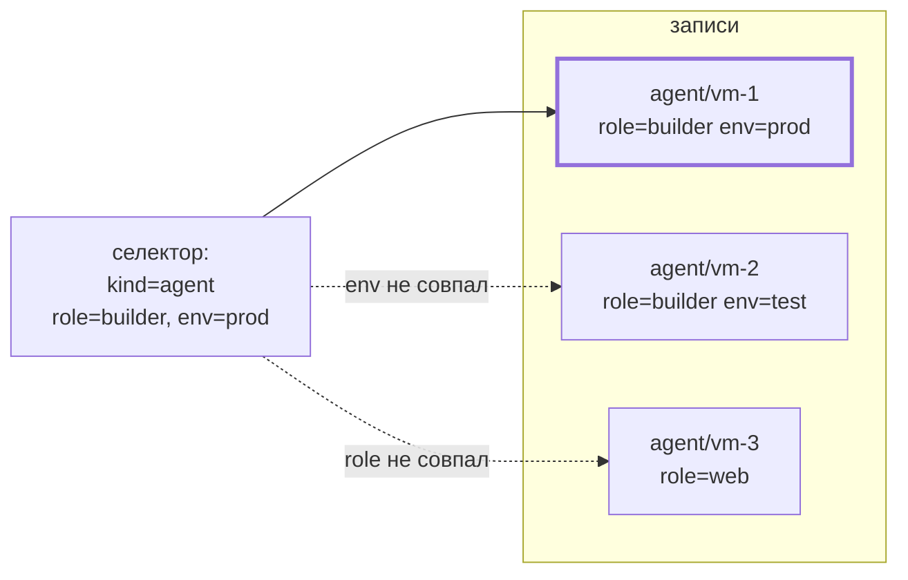

# Метки

## Маркеры, не данные

**Метка** — пара `ключ=значение` на любой записи и на ране. Семантика
меток метрик: выборка и группировка, никогда не данные. Метки
задаются при объявлении и меняются командой записи; система никогда
не интерпретирует значения.

Ключи под зарезервированным префиксом `graphene.io/` — **системные
метки**, их пишет только система; пользовательский ввод с этим
префиксом отклоняется. `graphene.io/run` называет ран, создавший
запись, — стабильна при передачах, в отличие от владельца.

## Выборка

**Селектор** — тип + фаза + владелец + метки; каждое заданное поле
должно совпасть. Выборка устроена одинаково везде, где есть метки:
списки записей, выбор агентов, фильтр ранов:

Матчинг — равенство и «одно из», больше ничего. Никаких сравнений,
выражений и версий: селектор, который система умела бы
интерпретировать, был бы ещё одним местом, где можно ошибиться.
