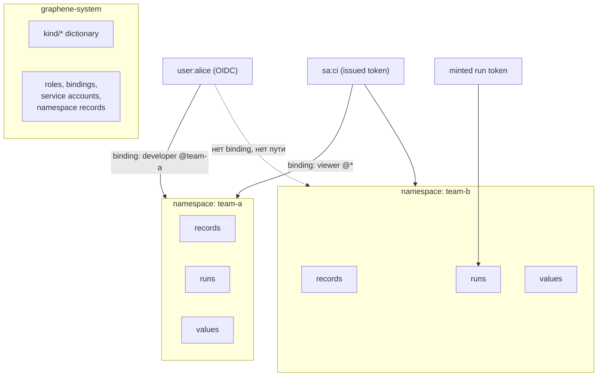

# Namespaces и доступ

## Единица изоляции

**Namespace** изолирует всё: записи, раны и values разных namespaces не видят
друг друга. Каждый namespace Graphene зеркалится в одноимённый namespace
Temporal — изоляция существует на уровне durable-ядра, а не как фильтр в коде
сервера.

Namespaces сами являются записями (`kind: namespace`) и объявляются и удаляются
как всё остальное. Они живут в системном namespace `graphene-system`: контейнер
не может содержать собственное объявление. Там же находятся роли, bindings и
service accounts инсталляции.

`graphene-system` защищён от удаления. `default` создаётся при первом запуске
как обычный проектный namespace и может быть удалён. Удаление *retire*'ит
namespace: инсталляция перестаёт его обслуживать, но содержимое стареет по его
retention, а не уничтожается немедленно. После рестарта retired namespace не
воскресает.

## Кто что может

Авторизация устроена аддитивно, как в Kubernetes: право — это
**verb × kind × namespace**, выданное записью `role` и связанное с субъектом
записью `rolebinding`. Есть три контура identity:

- **люди — OIDC**: инсталляция принимает `id_token` внешнего provider
  (`user:{sub}`, `group:{name}`) и не хранит собственные пароли;
- **машины — service accounts** (`serviceaccount/{id}`): записи, чьи токены
  инсталляция сама выдаёт и отзывает (`graphenectl account token`, значение
  показывается один раз);
- **раны и агенты — minted tokens**: ограничены одним раном или agent-записью и
  истекают вместе с ней; для проверки не нужно хранилище токенов.

Статические config-токены (`admin`, `run`, `agent`) остаются bootstrap- и
dev-путём и отображаются на встроенные роли.

Каждая команда попадает заметкой в историю самой записи — audit принадлежит
записи, а не отдельному журналу. Чтения не аудируются.
