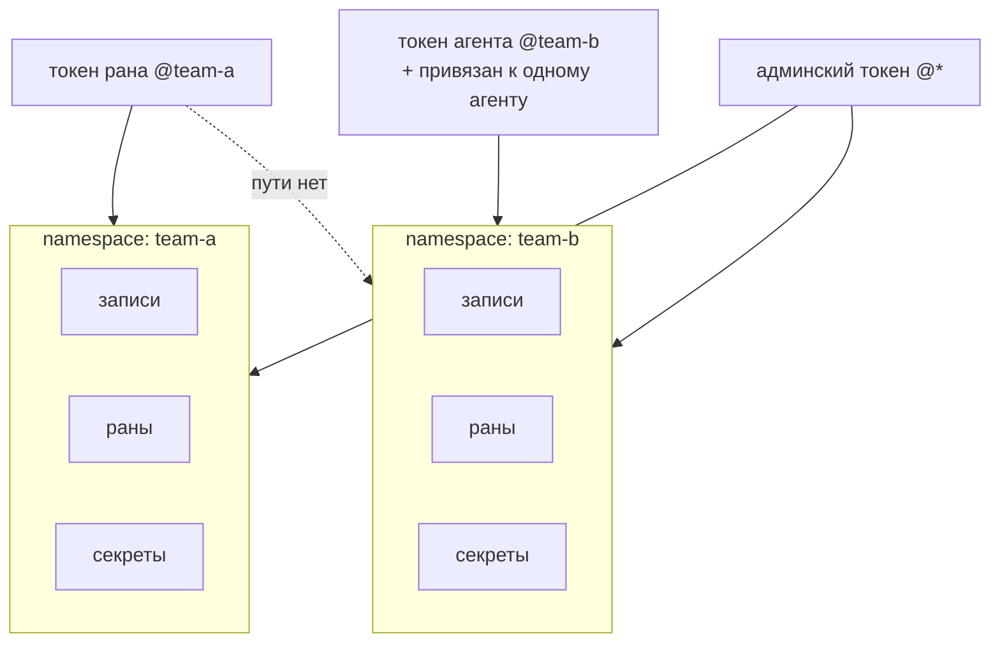

# Namespaces

## Единица изоляции

**Namespace** изолирует всё: записи, раны и секреты разных namespace
не видят друг друга. Каждый namespace graphene зеркалится в
одноимённый namespace Temporal — изоляция держится на уровне
durable-ядра, а не фильтров в коде сервера.

## Токены несут scope

**Токен** — единственный вид credentials. Три роли — `admin`, `run`,
`agent` — и каждый токен привязан к namespace; админский может быть
привязан ко всем:

Токен агента дополнительно привязан к одному агенту: он может
воплощать эту запись и никакую другую.
