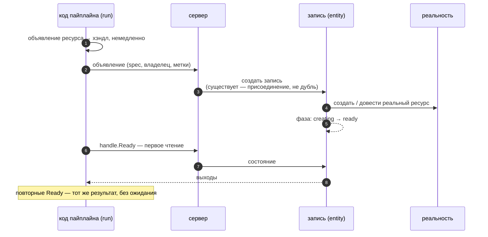
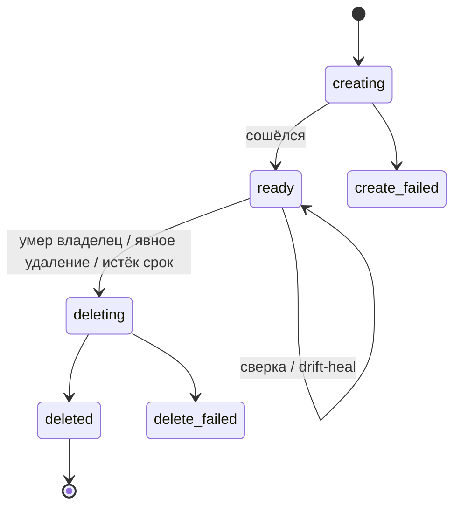
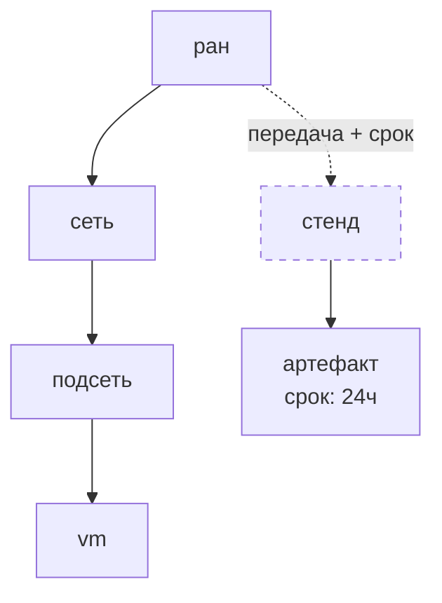
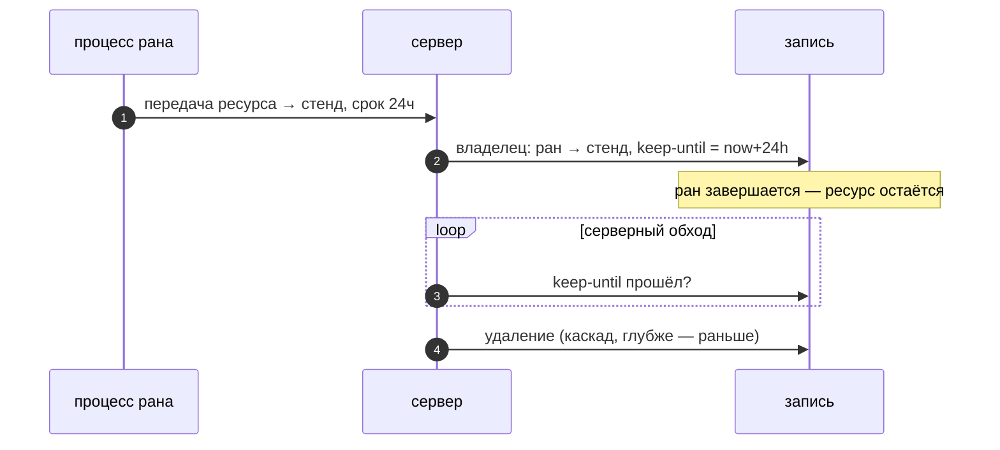

# Ресурсы

## Объявление возвращает хэндл

Объявление ресурса — обычный вызов функции в пайплайне. Он возвращает
**хэндл** немедленно, не блокируя; запись создаётся, а реальный ресурс
сходится в фоне:

Выходы ресурса доступны только через `Ready`: первое чтение ждёт
схождения, ошибка готовности валит ран в точке чтения. Неготовый
ресурс невозможно использовать по построению. Кому нужна ошибка в
руки — `TryReady`: та же операция, возвращающая ошибку значением
вместо падения рана.

## Запись живёт жизненным циклом

За каждым ресурсом — ровно одна запись. Её фаза видна в любой момент:

Запись — живой процесс: пока ресурс существует, она периодически
сверяет наблюдаемое состояние с желаемым. Исчезновение и расхождение —
повод пересоздать или довести; что считать расхождением — знание
ресурсной библиотеки.

## У каждого ресурса один владелец

Владелец — тот, вместе с кем ресурс умирает: другой ресурс, ран или
стенд. Ровно один; по умолчанию — создавший ран. Владельцы образуют
дерево: оно задаётся `Parent` и `Children` и меняется передачей:

Удаление владельца удаляет всё его поддерево, глубже — раньше: vm
прежде подсети, подсеть прежде сети. Отменённый или упавший ран — та
же смерть: его поддерево уходит той же дорогой.

Два принципа держатся везде:

- **Владение отдают — его не забирают.** Передачу выполняет сторона
  текущего владельца; ничто не может присвоить ресурс себе.
- **Чужое нельзя ни обременить, ни отдать.** Чужой ресурс можно
  *присоединить* — распознать и читать как любой хэндл, — но
  присоединённый ресурс не может быть родителем или ребёнком.

## Пережить свой ран

По умолчанию ресурсы рана умирают вместе с раном. Единственный способ
пережить его — явная передача: другому ресурсу или **стенду** —
постоянному владельцу, который есть у каждого пайплайна. Передача
переносит ресурс вместе с поддеревом и может задать **срок жизни** —
по его истечении сервер удаляет поддерево сам:

Без срока переданный ресурс живёт до явного удаления.
